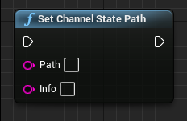
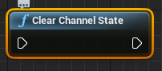
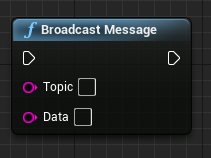
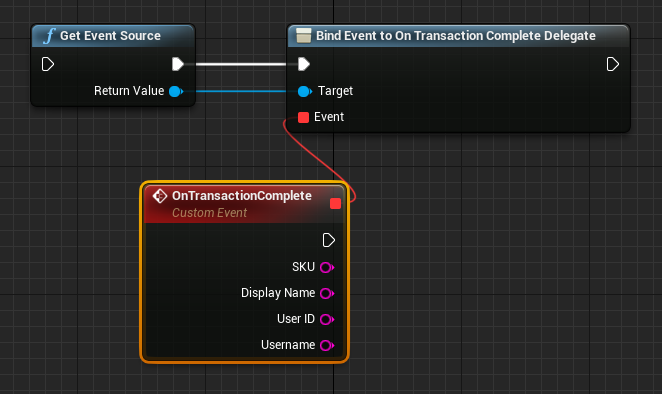

# Basic Usage

!!! warning "Archived documentation"
    This page is retained for URL compatibility. It is not maintained, indexed, or included in agent exports.

Here's how you implement some basic operations, which include:

- Using Muxy's extension and viewer state information
- Broadcasting messages to your viewers
- Accepting bit transactions in your game

## Retrieve and Use State Information

To maintain state, use the `Set Channel State` node.

{ width="232" height="151" loading="lazy" }

- **Path** is a dot-delimited path string that points to the state object
- **Info** is a JSON object string to be placed at that path.

To clear out existing state use the `Clear Channel State` node.

{ width="202" height="89" loading="lazy" }

## Broadcast Message to Viewers

A common requirement is to have the client extension update instantly in response to creating a poll or other
game action. The broadcast API pushes a notification to all viewers.

{ width="211" height="158" loading="lazy" }

- **Topic** is a string is used on the client as a discriminator
- **Data** is JSON object. (Note that the Muxy API does not provide a way to manipulate JSON strings, so you need a third-party plugin to construct the data object.)

## Accept Bit Transactions

Bit transactions are exposed as events on the Event Source.

{ width="662" height="394" loading="lazy" }

- **SKU** is the product that was purchased
- **User ID** is the Twitch user ID of the user who purchased the product.
- **Display Name** is the display name of the product that was purchased.
- **Username** is the user-facing display name of the user who purchased the product.
