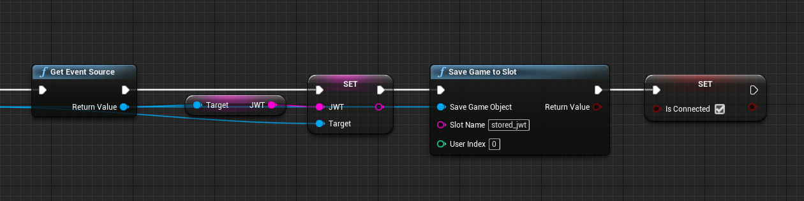
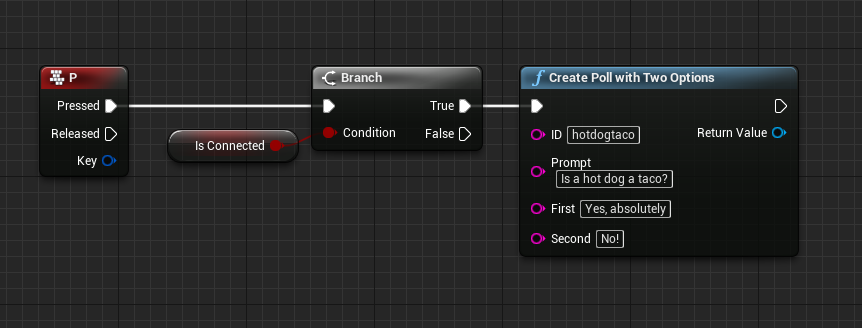
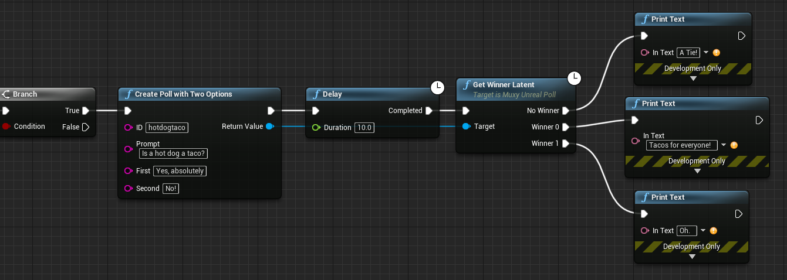

# Implement GameLink Polling

!!! warning "Archived documentation"
    This page is retained for URL compatibility. It is not maintained, indexed, or included in agent exports.


Polling is a frequent task for games that are integrated with GameLink.
Using the [basic extension setup](initialize-the-extension.md), this guide illustrates how to:

- [Create a poll through GameLink](#creating-a-poll)
- [Display the poll in a viewer extension](#displaying-the-poll)
- [Get the results in the game](#getting-results)

The procedures assume that you have [installed the Unreal Plugin](install-the-muxy-plugin-for-unreal-engine.md) and [set up the login flow](create-a-muxy-login-flow.md) so that your extension can communicate with the Muxy server.
The example continues using the Unreal project after you have added the login flow.

> Read more about [Poll Management](../docs/manage-polling.md)

## Creating a poll

Creating a poll requires an active, authenticated connection to GameLink. Usually
a poll would be created in response to the player doing something, but in this
example the poll will just be created when a player pushes a keyboard button.

Creating a poll when the connection is not active is an error. To prevent the
user from attempting to create a poll before the connection is established,
create a boolean variable in the level blueprint, named `IsConnected` and
set it to `true` during the `On Muxy Auth` event:


{ width="1260" height="315" loading="lazy" }


### Basic Poll Setup

Below is a simple poll setup. Notice how it is guarded against creating a poll
before the connection is completed by the `Is Connected` boolean.


{ width="862" height="328" loading="lazy" }


Launch the game, connect to GameLink (either by using a code, or allowing the
automatic JWT authorization to complete), and press 'P' to create a poll.

Because the `ID` field is hardcoded, repeated Create Poll calls will not create additional polls. Repeating this call updates the existing poll that has the ID `hotdogtaco`.

## Displaying the poll

When you have created the poll, you have to display it to the viewer so they can view it and vote.

Modify the body contents of `viewer.html` and `src/viewer.js` in the sample:

**viewer.html**

```html
<body>
    <script src="./dist/viewer.js"></script>
    <h2>Prompt: <span id="prompt"></span></h2>
    <a href="javascript:;" onclick="voteFirst" id="first"></a>
    <br/>
    <a href="javascript:;" onclick="voteSecond" id="second"></a>
  </body>
```

**src/viewer.js**

```javascript
const sdk = new Muxy.SDK();
sdk
  .loaded()
  .then(() => {
    return sdk.getChannelState()
  })
  .then(state => {
    const poll = state["hotdogtaco"];

    document.getElementById("message").innerText = poll.prompt;
    document.getElementById("first").innerText = poll.options[0];
    document.getElementById("second").innerText = poll.options[1];
  });

function voteFirst() {
  sdk.vote("hotdogtaco", 0);
}

function voteSecond(){
  sdk.vote("hotdogtaco", 1);
}
```

The free functions `voteFirst()` and `voteSecond()` are referenced in the HTML, and
use the hardcoded vote ID to cast the votes. It is important to note that options are
zero indexed. If a single user votes multiple times on a poll, only the most recent
vote will be counted.

## Getting results

Once viewers have voted, you need to get the results, and then act on them.
The GameLink node `Get Winner Latent` on poll objects will get the current vote
count and determine a winner. A common way of running polls is to start a poll,
wait for a duration, and then get the results at the end of that duration. A sample
blueprint to do that is shown here:

{ width="1341" height="478" loading="lazy" }
