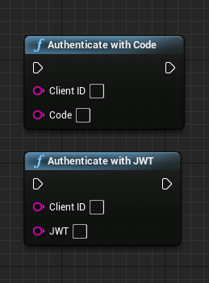
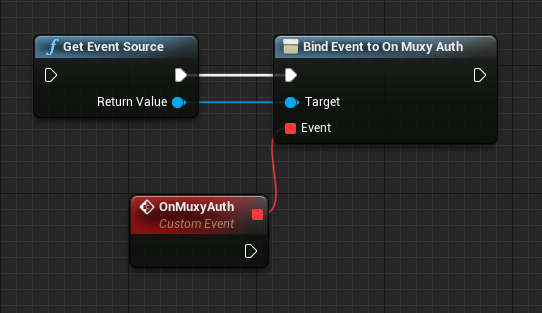
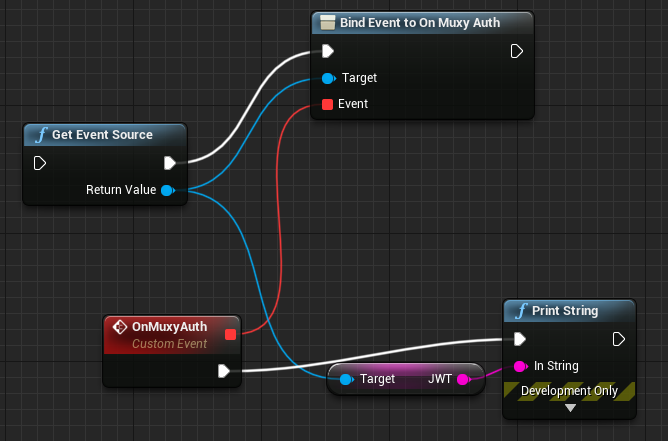

# Initialize the Muxy Plugin

!!! warning "Archived documentation"
    This page is retained for URL compatibility. It is not maintained, indexed, or included in agent exports.

The Muxy Plugin exposes a set of static blueprint functions and a singleton global source object, `MuxyEventSource`.
To initialize the plugin, you use a blueprint to authenticate the user, then provide a callback that reacts to an `authorization` event.

## Authenticate the User

Before calling any functions, the game must authenticate the user by calling one of the Authorization blueprints:  `Authenticate with JWT` or `Authenticate with Code`.

{ width="259" height="351" loading="lazy" }

These blueprints accept two inputs:

- A _Twitch Extension Client ID_, which is obtained from the Twitch Developer Portal.
- Either a JavaScript web token (JWT) or Login Code from the Muxy API. (See the [Login Flow guide] for how to get a Login Code.)

On first use, you will use `Authenticate with Code`. When you make this call, it returns a JWT that you can then use for subsequent calls to `Authenticate with JWT`. The JWT returned from any authorization is valid for 30 days. Using Authenticate with JWT will grant a new JWT that is valid for 30 days.

## Receive Authentication Response

To receive the authorization event use the `Get Event Source` node to get the event source, and assign onto the `MuxyAuth` event.

{ width="542" height="313" loading="lazy" }

When this event fires, the event source will have the updated JWT that should be persisted for logins in the future. This event will fire for both login styles.

{ width="668" height="441" loading="lazy" }
