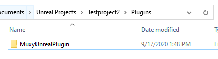
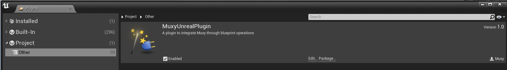

# Install the Muxy Plugin for Unreal Engine

!!! warning "Archived documentation"
    This page is retained for URL compatibility. It is not maintained, indexed, or included in agent exports.

This retired guide described a GameLink plugin for Unreal Engine 4.25. The binary download referenced by the original page is no longer publicly available, so these steps are preserved only as historical context and must not be used for a new integration.

## Install the Plugin

1. Obtain an internally approved copy of the retired `MuxyUnrealPlugin` source. There is no supported public download.
2. Copy the parent directory, `MuxyUnrealPlugin`, into a `Plugins` folder at the root of your Unreal Engine 4.25 project.
   (Create the folder if necessary.)

{ width="430" height="118" loading="lazy" }

3. If the editor is running, restart it to update the contents fo the `Plugins` directory.

4. Scroll to the bottom of the **Edit > Plugins** menu to see **MuxyUnrealPlugin** in the
   **Other** category.

5. Check **Enable**.

{ width="1659" height="231" loading="lazy" }

## Next Steps

The Muxy UnReal Plugin exposes a set of static blueprint functions and a singleton object, `MuxyEventSource`, with methods for reacting to _authorization_, _polling_, and _transaction_ events.

Before your game can use Muxy functionality, you must allow the broadcaster to log in to the Muxy server, so that you can initialize the plugin by authenticating the user for each login session.

- [Initializing the Muxy Plugin](../docs/initialize-the-extension.md)
- [Integrate the Muxy Login Flow](../docs/create-a-muxy-login-flow.md) into your game.

Use the provided blueprints and methods to integrate Muxy functionality into your Unreal Engine game:

- [Retrieve and Use State Information](../docs/basic-usage-examples.md)
- [Broadcast Messages](../docs/basic-usage-examples.md)
- [Accept Bit Transactions](../docs/basic-usage-examples.md)
