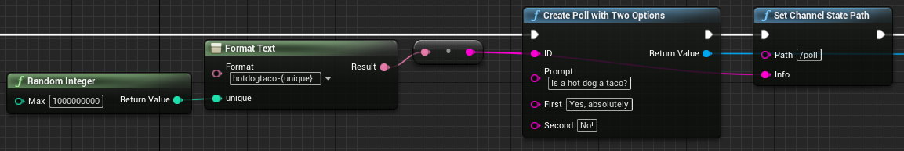
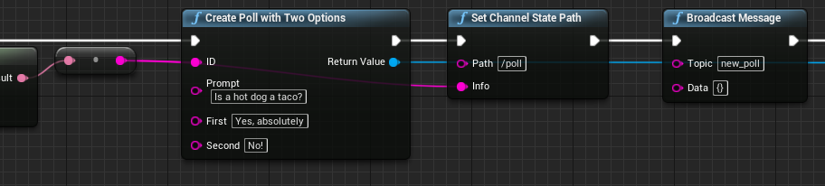
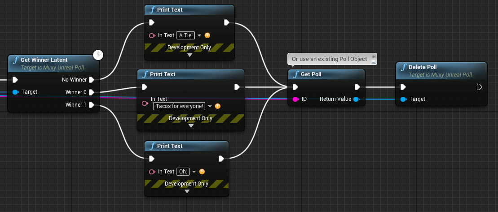
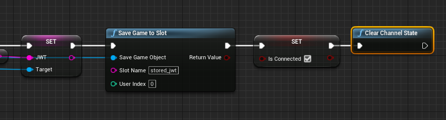
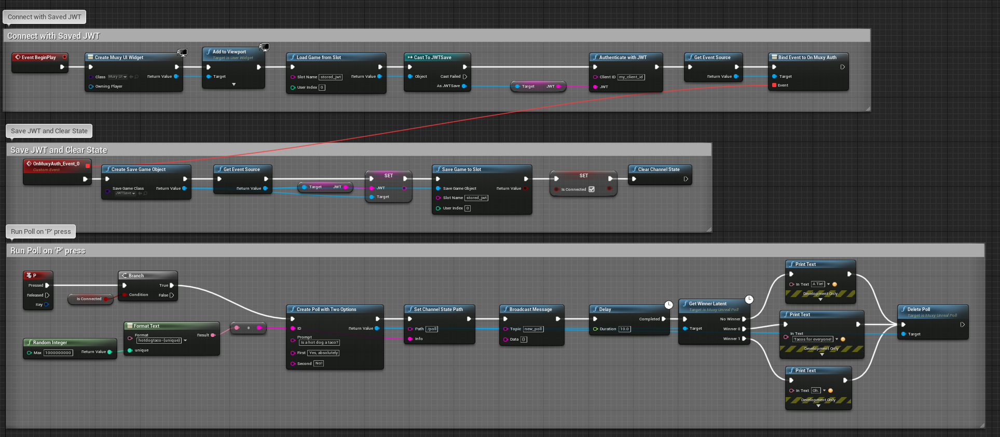

# Manage Polling

!!! warning "Archived documentation"
    This page is retained for URL compatibility. It is not maintained, indexed, or included in agent exports.


When you have multiple polls running concurrently or overlapping with one another, you should employ specific management techniques to ensure smooth operation.

- When you [create new polls](#creating-new-polls), make sure they have unique IDs.
- When you have created a new poll, you need to [inform viewers](#informing-viewers-of-new-polls) that it is available.
- To control resource usage, you should [remove old polls](#removing-old-polls) when they are finished.

## Creating new polls

A poll ID exists for up to one week after the last vote is cast for it, in order to support
long-term poll auditing. If you run a poll with the same poll ID as an existing
one, the results are added the existing poll.

To create a fresh poll with zero votes, you must add a parameter to ensure that the new poll
ID is unique. This is typically a random number to be appended to the generated ID.
For a generated ID like this, you cannot hard-code for a particular poll ID you want to look up. Instead, you need to store ID value in a well-known state key:


{ width="1153" height="193" loading="lazy" }


The following code shows how to change the front end to use the indirection:

**src/viewer.js**

```javascript
const sdk = new Muxy.SDK();
sdk
  .loaded()
  .then(() => {
    return sdk.getChannelState()
  })
  .then(state => {
    const pollID = state["poll"];
    const poll = state[pollID];

    document.getElementById("message").innerText = poll.prompt;
    document.getElementById("first").innerText = poll.options[0];
    document.getElementById("second").innerText = poll.options[1];
  });
```

## Informing viewers of new polls

To reduce unnecessary network traffic, the GameLink API methods do not broadcast automatically.
Viewers are not notified when you create a new poll or set channel state. Unless you explicitly broadcast a message that a new poll is available, existing viewers will never see  it show up.

To broadcast that new data is available, use the `Broadcast Message` node:


{ width="912" height="206" loading="lazy" }


**TODO** _When better JSON support is in the muxy plugin, show how to send
the state through the Broadcast Message call instead of having to
re-query channel state in the frontend_

The following code shows how to change the front end to listen for this new event:

**src/viewer.js**

```javascript
const sdk = new Muxy.SDK();
function updateState() {
  sdk.getChannelState()
    .then(state => {
     const pollID = state["poll"];
      const poll = state[pollID];

      document.getElementById("message").innerText = poll.prompt;
      document.getElementById("first").innerText = poll.options[0];
      document.getElementById("second").innerText = poll.options[1];
    });
}

sdk
  .loaded()
  .then(() => {
    sdk.listen("new_poll", () => {
      updateState();
    });

    updateState();
  });
```

## Removing old polls

Creating a new poll adds a data entry to the channel state. To prevent stale polls from filling up the channel state value, use the `Delete Poll` node after a poll has finished:


{ width="1109" height="473" loading="lazy" }


For dynamic polling state like this, it is also good practice to clear out
all the existing state on startup so that the game starts with a known prior
state. This can be done by using the `Clear Channel State` node on connection:


{ width="886" height="239" loading="lazy" }


## Final Blueprint

For reference, an image of the complete blueprint is included below. This is not
well encapsulated blueprint code, but can be used as a basic reference for how to
do dynamic polling:


{ width="1927" height="843" loading="lazy" }
