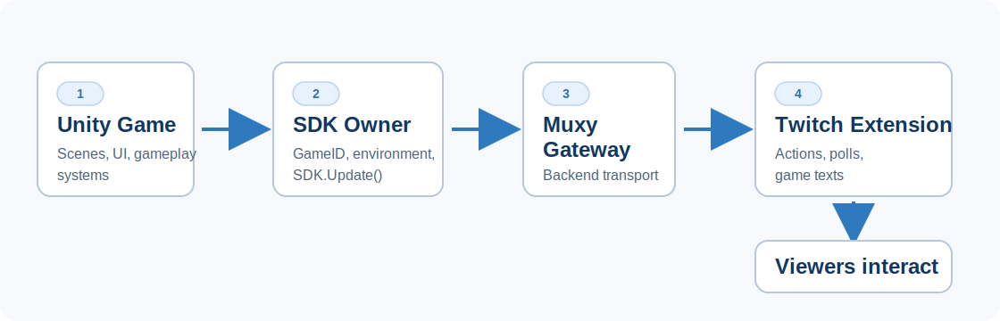
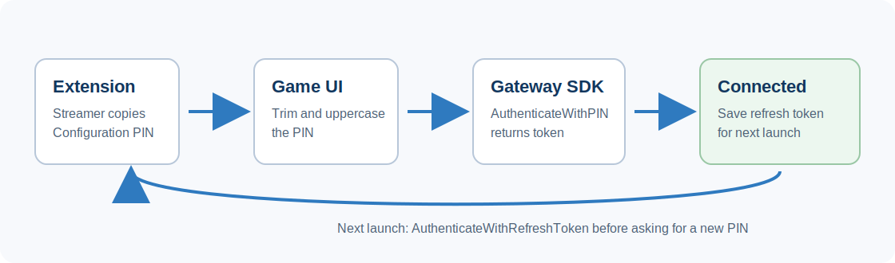
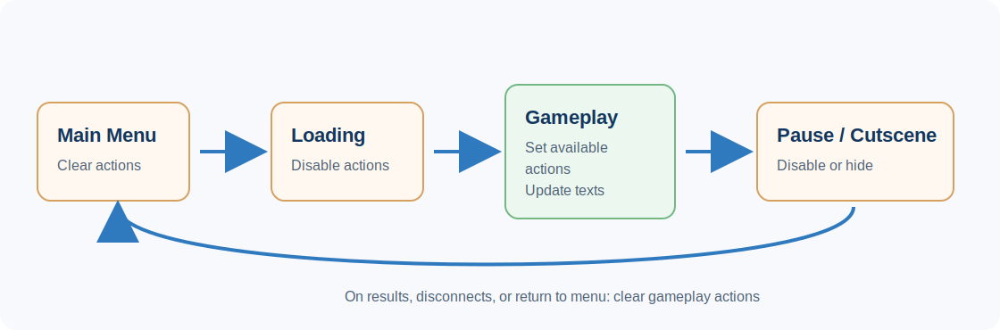
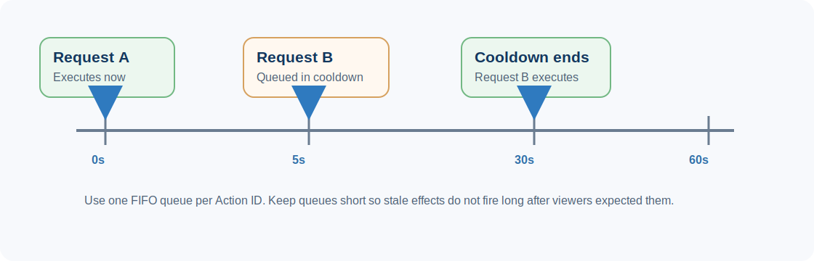
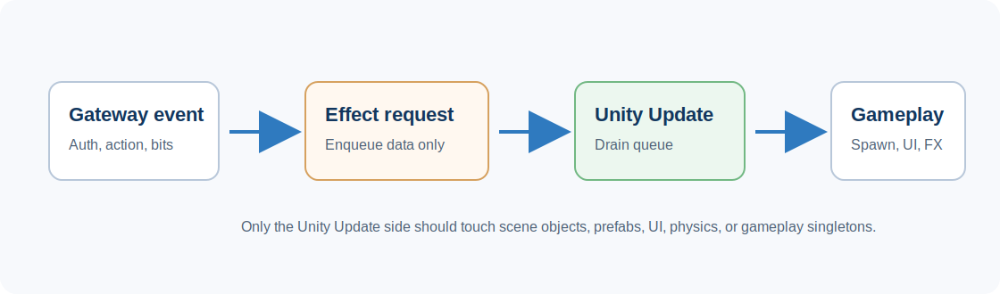

# Unity Gateway Tutorial

# What is Gateway and why do I want to use it?

Gateway makes it easy to integrate features into your game that can be interacted with by viewers on Twitch. One of the hardest parts of making live interaction work is building a front-end extension for the viewers to use, and as a game developer you may not have the resources or knowledge to do so. Gateway handles the front-end extension for you, so all you need to do is integrate the easy-to-use Gateway library into your game and you'll be ready to go!

# Gateway Features Overview

## Actions

An action can be used by the audience to trigger events in game, and can be one of three categories: Helpful, Neutral, Hinder.\
Actions have a cost and are configurable in different ways, such as how many are available to use, the impact it has on the game, and other options.


## Polls

Polls allow the audience to vote on different options to trigger events in game.\
Polls can configure the duration and amount of times each viewer can vote.


## Game Texts

Game Texts are simply label/value pairs of text with an icon. They are useful for displaying information about what is happening in game.


## Bits

Bits are similar to actions, but you don't get the same fine grain control. Things like enabling/disabling, inventory counts, and other options aren't configurable with bits.


***karlaplan is just the example name for the coins. Streamers can name their coins whatever they want!***

# Game Developer: Getting Started

## Setup Game Library

First you must install Gateway from <https://github.com/muxy/gateway-unity>. If you're unfamiliar with how to install a package, see the Unity manual here <https://docs.unity.cn/ru/2021.1/Manual/upm-ui-giturl.html>

Once you have Gateway in your project, you will need to set up an entity to access the Gateway SDK.

Create an entity and add a new component with the following script:

```csharp
using System.Collections;
using System.Collections.Generic;
using UnityEngine;
using MuxyGateway;

public SDK SDK;
public String GameID;
public bool Production;

void Start()
{
    SDK = new(GameID);
    if (Production)
    {
        SDK.RunInProduction();
    }
    else
    {
        SDK.RunInSandbox();
    }
}

public void Update()
{
    SDK.Update();
}
```

> 📘 For the sake of the guide, we will assume all the examples given for each feature will go inside this script we've just made. The important thing is that you have a way to access the SDK, do whatever works best for your project.


### Partner implementation best practices: SDK owner, environment, and update loop

For production partner integrations, treat the Unity scene or configuration asset that owns the Gateway SDK as the source of truth for `GameID` and environment. Example IDs in docs are useful for learning, but the value that should ship is the Game ID issued or confirmed for that partner project.

Recommended setup practices:

- Keep exactly one persistent Gateway SDK owner in the running game, usually a `DontDestroyOnLoad` manager or a bootstrap scene object.
- Expose `GameID` and `Production` in the inspector or a project configuration asset so QA can verify the intended environment without changing code.
- Do not hard-code the final websocket URL. Use the SDK environment methods (`RunInProduction`, `RunInSandbox`, or the SDK-provided production/sandbox URL helpers) so Gateway can supply the correct host and path.
- Call `SDK.Update()` from Unity's main `Update()` loop for as long as the Gateway connection is active.
- Log the selected environment and Game ID at startup, but never log broadcaster tokens, JWTs, refresh tokens, or full authentication payloads.

If a partner already has a known-working Game ID in their scene, use that value for verification. Changing it to a generic tutorial ID can make an otherwise healthy integration look broken.



Partner-ready persistent manager example:

```csharp
using UnityEngine;
using MuxyGateway;

public sealed class GatewayManager : MonoBehaviour
{
    public static GatewayManager Instance { get; private set; }

    [SerializeField] private string gameID;
    [SerializeField] private bool production = true;

    public SDK SDK { get; private set; }
    public bool IsReady { get; private set; }

    private void Awake()
    {
        if (Instance != null && Instance != this)
        {
            Destroy(gameObject);
            return;
        }

        Instance = this;
        DontDestroyOnLoad(gameObject);

        SDK = new SDK(gameID);
        Debug.Log($"[Gateway] Starting. production={production}, gameID={gameID}");

        if (production)
            SDK.RunInProduction();
        else
            SDK.RunInSandbox();

        IsReady = true;
    }

    private void Update()
    {
        SDK?.Update();
    }
}
```

## Authentication

The very first thing that must be done after SDK setup is authentication. It's common to make a "Gateway Authentication" tab in the options menu that has a text input for the PIN.


*The image above is from Renfield: Bring Your Own Blood option menu. Notice the Muxy Gateway button at the bottom.*


*The image above is the authentication menu for the game Renfield: Bring Your Own Blood. The broadcaster places their PIN code from the Muxy Gateway Twitch Extension configuration page.*

Authentication code usually looks something like:

```csharp
private SDK.OnAuthenticateDelegate AuthCB;

void SetupCallbacks()
{
    AuthCB = (Response) =>
    {
        if (Response.HasError)
        {
            PlayerPrefs.SetString("RefreshToken", "");
            return;
        }

        PlayerPrefs.SetString("RefreshToken", Response.RefreshToken);
      
      	// It's common to setup and register things here when an auth is successful
        // We will go over what these functions do in a moment
        SDK.OnActionUsed(ActionCB);
        SetGameMetadata();
    };
}

void CheckForRefreshToken()
{
    String RefreshToken = PlayerPrefs.GetString("RefreshToken", "");
    if (RefreshToken != "")
    {
        SDK.AuthenticateWithRefreshToken(RefreshToken, AuthCB);
    }
}

void Authenticate(String PIN)
{
    SDK.AuthenticateWithPIN(PIN, AuthCB); 
}

void Start()
{
    // ...
    SetupCallbacks();
    CheckForRefreshToken();
}
```

The first authentication the streamer performs will need to be with a PIN, so you would just call `Authenticate(PIN)` for the first authentication attempt.

If a streamer successfully authenticates with a PIN, a refresh token will be given inside the authentication callback that can be stored for later use.

The refresh token allows the streamer to authenticate without needing to enter a PIN every time.

We call `SDK.OnActionUsed(ActionCB)` which simply registers a callback with the SDK for when an action is used. There is other `.On_` methods (like `SDK.OnBitsUsed(BitsCB)` for example) that you can register if you need those features.

We also call `SetGameMetadata()`which sets our games metadata (we will cover this in the next section).

Once authentication is completed all the features of Gateway become available.


### Partner implementation best practices: authentication UX and token handling

Broadcasters should only need to use the PIN flow the first time they connect, when they intentionally switch accounts, or when a saved refresh token has expired or been revoked.

Recommended authentication practices:

- Put the PIN entry flow somewhere broadcasters can find before going live, such as an options menu, lobby, streamer tools panel, or connection settings popup.
- Normalize PIN input by trimming whitespace and uppercasing before calling `AuthenticateWithPIN`.
- Show clear connection states in the game UI: connecting, connected, not connected, authentication failed, and timed out.
- Store the refresh token only after a successful authentication response, and clear it on failed silent re-authentication.
- Provide a visible "Log out" or "Clear saved token" path so a broadcaster can switch accounts without deleting local game data.
- Add an authentication timeout in the UI layer so the broadcaster is not left waiting forever if the network or Gateway environment is unavailable.

When registering callbacks after authentication, be careful to avoid duplicate listener registration across scene reloads or repeated successful auth attempts. If your Gateway manager persists between scenes, register callbacks once or explicitly guard against duplicate registration.



Partner-ready PIN authentication wrapper:

```csharp
using System;
using System.Collections;
using UnityEngine;
using MuxyGateway;

public sealed class GatewayAuthenticator : MonoBehaviour
{
    private const string RefreshTokenKey = "GatewayRefreshToken";
    private const float AuthTimeoutSeconds = 20f;

    private SDK sdk;
    private Coroutine timeoutRoutine;
    private bool callbackReceived;

    public bool IsAuthenticated { get; private set; }

    public void Initialize(SDK gatewaySdk)
    {
        sdk = gatewaySdk;
    }

    public void TryRefreshToken()
    {
        string refreshToken = PlayerPrefs.GetString(RefreshTokenKey, "");
        if (string.IsNullOrEmpty(refreshToken))
            return;

        sdk.AuthenticateWithRefreshToken(refreshToken, HandleAuthResponse);
    }

    public void AuthenticateWithPin(string pin)
    {
        if (sdk == null)
        {
            ShowStatus("Gateway is not ready.");
            return;
        }

        string normalizedPin = pin.Trim().ToUpperInvariant();
        if (string.IsNullOrEmpty(normalizedPin))
        {
            ShowStatus("Enter a Gateway PIN.");
            return;
        }

        callbackReceived = false;
        timeoutRoutine = StartCoroutine(AuthTimeout());
        ShowStatus("Connecting to Gateway...");

        sdk.AuthenticateWithPIN(normalizedPin, HandleAuthResponse);
    }

    private void HandleAuthResponse(AuthenticationResponse response)
    {
        callbackReceived = true;

        if (timeoutRoutine != null)
            StopCoroutine(timeoutRoutine);

        if (response.HasError)
        {
            PlayerPrefs.DeleteKey(RefreshTokenKey);
            PlayerPrefs.Save();
            IsAuthenticated = false;
            ShowStatus("Gateway authentication failed.");
            return;
        }

        PlayerPrefs.SetString(RefreshTokenKey, response.RefreshToken);
        PlayerPrefs.Save();
        IsAuthenticated = true;
        ShowStatus("Gateway connected.");
    }

    private IEnumerator AuthTimeout()
    {
        yield return new WaitForSeconds(AuthTimeoutSeconds);

        if (!callbackReceived)
            ShowStatus("Gateway authentication timed out.");
    }

    public void Logout()
    {
        PlayerPrefs.DeleteKey(RefreshTokenKey);
        PlayerPrefs.Save();
        IsAuthenticated = false;
        ShowStatus("Gateway disconnected.");
    }

    private void ShowStatus(string message)
    {
        Debug.Log("[Gateway] " + message);
        // Also update your connection status UI here.
    }
}
```

## Game Metadata

One important thing you will want to do is set the metadata for your game. This means setting your games name, logo, and theme for the front-end Gateway extension to use and display to viewers.

`SetGameMetadata` is the function we called in the success block of the `AuthCB` in the previous Authentication section.

```csharp
void SetGameMetadata()
{ 
  	Texture2D GameLogo = Resources.Load<Texture2D>("Textures/Gateway/MyGameLogo.png");
  
    GameMetadata Meta = new();
    Meta.Name = "My awesome game!";
    Meta.Logo = SDK.ConvertTextureToImage(GameLogo); // base64 encoded image
    Meta.Theme = ""; // empty for default theme
    SDK.SetGameMetadata(Meta);
}
```

> 📘 Meta.Logo (Your game's logo) Tips
>
> Your Meta.Logo Texture2D format should be **RGB24** or **RGBA32** and no larger than 500KB. It will be converted to a PNG image for display in the extension and although the aspect ratio will be preserved, the resolution may need to be scaled to fit. You can set the format on the Texture2Ds import settings.
>
> The PNG will be restrained to 50 px height. We suggest using a square or a 2:1 ratio rectangular logo.


This is the result you should see in the extension at the top from calling `SetGameMetadata`. Your game's logo icon should appear in the top left of the Gateway Twitch Extension when it is authenticated with your game, and the name in the top right.


### Partner implementation best practices: metadata timing

Set game metadata immediately after successful authentication and whenever a live configuration change needs to be reflected in the extension. Metadata should be stable, recognizable, and lightweight.

Recommended metadata practices:

- Use the public game name viewers will recognize, not an internal codename.
- Keep the logo readable at small sizes and verify it in the extension after conversion.
- Leave theme blank when using the default Gateway presentation unless Muxy has provided a partner-specific theme value.
- Avoid updating metadata every frame. Metadata is usually a connection/authentication-time concern, while changing gameplay values belong in Game Texts.


## Actions

First, we must create an array of the actions we want viewers to be able to purchase to affect the broadcaster's game. A great place to learn more about actions is in this blog post <https://www.muxy.io/post/how-to-create-actions-in-muxy-gateway>. Then we must make a callback for when an action is used. Remember we called `SDK.OnActionUsed(ActionCB)` in the authentication section, so that is where `ActionCB` is registered at.

> 👍 Impact and Count
>
> When setting up Actions, you will need to set up both the Gameplay Impact and Count.
>
> **Impact** is a score from 0 to 5. Zero, 0, has the lowest impact to the game; an example of a "Zero Impact" action would be a Neutral Action to Rename an Enemy with Your Twitch Username. One, 1, has a slight impact to the game; an example is providing a 10% damage boost for 10 seconds. Each action increases in gameplay impact as the impact score gets closer to five, 5. A "Five Impact" action has a dramatic effect on the game; an example would be completely knocking an ally off the field of play or causing the level to reset.
>
> **Count** is the total Actions available to viewers during a session. When actions run out, the Action will be disabled in the extension. Actions with extremely high gameplay impact, you’ll want to set a limit to the number of actions that can be taken per session. A session is, for example, a battle or a match in a card game. You’ll want to set Actions that deeply impact the game to a low count. Actions that barely impact the game (like enemy renaming) can be set to infinite which, as a value, is `Action.InfiniteCount`.


### Partner implementation best practices: action availability

Actions are most successful when they are available only during moments where the game can safely and clearly respond to them.

Recommended action availability practices:

- Register or enable gameplay actions only when the player is in an active gameplay state.
- Clear, hide, or disable actions during menus, loading screens, cutscenes, pause states, scene transitions, and post-match result screens.
- Keep action IDs stable after launch. Partner dashboards, telemetry, QA scripts, and player-facing docs may depend on them.
- Use `Impact` and `Count` together. High-impact Hinder actions often need lower counts, stricter availability, or a cooldown policy.
- Use action names and descriptions that explain the viewer-visible result, not internal implementation terms.



Partner-ready stage-gated action registration:

```csharp
private bool actionsRegistered;

void UpdateGatewayActionAvailability()
{
    if (!IsAuthenticated)
        return;

    bool inGameplay = IsGameplayReadyForViewerActions();

    if (inGameplay && !actionsRegistered)
    {
        SDK.SetGameActions(Actions);
        actionsRegistered = true;
        Debug.Log("[Gateway] Actions available.");
    }
    else if (!inGameplay && actionsRegistered)
    {
        SDK.SetGameActions(new GameAction[0]);
        actionsRegistered = false;
        Debug.Log("[Gateway] Actions cleared.");
    }
}

bool IsGameplayReadyForViewerActions()
{
    return CurrentScreen == GameScreen.Playing
        && !IsLoading
        && !IsPaused
        && Player != null;
}
```

### Partner implementation best practices: cooldowns and effect queues

Gateway tells your game that a viewer action was used. Your game still decides when and how that effect should be applied. For effects that should not stack instantly, add a per-action cooldown policy in your game code.

Recommended cooldown model:

- Define an `ActionID -> cooldown seconds` map. For example, a boss spawn may need a longer cooldown than a small speed boost.
- Track `ActionID -> next available time` using Unity time.
- Track `ActionID -> pending requests` if you want to queue requests that arrive during cooldown.
- When an action arrives off cooldown, execute it immediately and restart that action's cooldown.
- When an action arrives during cooldown, choose one policy per action: queue it, reject/refund it, or temporarily disable the action in Gateway until the cooldown expires.
- Keep cooldown queues small. A good default is 3 to 5 queued requests per action or a short time-to-live so old effects do not fire long after they made sense.

Queue behavior should be predictable:

- Use FIFO order per Action ID rather than one global queue.
- Do not let a high-impact Hinder queue block unrelated Help actions.
- Show feedback when an effect is queued and when it activates.
- For delayed effects, store the viewer name and transaction/action data with the queued request so messages, refunds, or accept calls can still refer to the correct viewer action.
- Execute queued gameplay effects from Unity's main thread, just like immediate effects.



```csharp
using System;
using System.Collections.Generic;
using UnityEngine;
using MuxyGateway;

public sealed class GatewayActionCooldowns
{
    private sealed class QueuedEffect
    {
        public GameActionUsed UsedAction;
        public float ReceivedAt;
    }

    private readonly Dictionary<string, float> cooldownSeconds = new Dictionary<string, float>();
    private readonly Dictionary<string, float> nextAvailableAt = new Dictionary<string, float>();
    private readonly Dictionary<string, Queue<QueuedEffect>> queues = new Dictionary<string, Queue<QueuedEffect>>();

    private readonly Action<GameActionUsed> executeEffect;
    private readonly Action<GameActionUsed, string> showMessage;

    public GatewayActionCooldowns(
        Action<GameActionUsed> executeEffect,
        Action<GameActionUsed, string> showMessage)
    {
        this.executeEffect = executeEffect;
        this.showMessage = showMessage;
    }

    public void Configure(string actionID, float cooldown)
    {
        cooldownSeconds[actionID] = cooldown;
        nextAvailableAt[actionID] = 0f;
        queues[actionID] = new Queue<QueuedEffect>();
    }

    public void Handle(GameActionUsed used)
    {
        if (!cooldownSeconds.ContainsKey(used.ActionID))
        {
            ExecuteNow(used);
            return;
        }

        if (Time.time >= nextAvailableAt[used.ActionID])
        {
            ExecuteNow(used);
            return;
        }

        Queue<QueuedEffect> queue = queues[used.ActionID];
        if (queue.Count >= 3)
        {
            showMessage?.Invoke(used, "Action queue is full.");
            return;
        }

        queue.Enqueue(new QueuedEffect
        {
            UsedAction = used,
            ReceivedAt = Time.time
        });

        showMessage?.Invoke(used, "Action queued.");
    }

    public void Update()
    {
        foreach (var pair in queues)
        {
            string actionID = pair.Key;
            Queue<QueuedEffect> queue = pair.Value;

            if (queue.Count == 0 || Time.time < nextAvailableAt[actionID])
                continue;

            QueuedEffect queued = queue.Dequeue();
            ExecuteNow(queued.UsedAction);
        }
    }

    private void ExecuteNow(GameActionUsed used)
    {
        executeEffect?.Invoke(used);

        float cooldown = 0f;
        cooldownSeconds.TryGetValue(used.ActionID, out cooldown);
        nextAvailableAt[used.ActionID] = Time.time + cooldown;
    }
}
```


The `Name` field is `"Spawn Elite Enemy"` and the `Description` is `"Spawn an elite enemy that will also have your name above"`. The description text appears when the viewer has their mouse pointer hover over the Action. NOTE: This will be changing: The Icon `ID` can use any icons that Gateway supports. A search for the library of icons Gateway supports is available here <http://icon-search.muxy.io/>

```csharp
Action[] Actions = 
{
    new Action 
    {
        Name = "Spawn Healthpack",
        Description = "Spawn a healthpack near the player",
        Icon = "fa-regular:heart", // base64 encoded image
        ID = "healthpack",
        Category = ActionCategory.Help,
        State = ActionState.Available,
        Impact = 2,
        Count = Action.InfiniteCount
    },

    new Action 
    {
        Name = "Kill Player",
        Description = "Kill the player and make them restart the level!",
        Icon = "fa-regular:skull-crossbones", // base64 encoded image
        ID = "killplayer",
        Category = ActionCategory.Hinder,
        State = ActionState.Available,
        Impact = 5,
        Count = 1
    }
}

private SDK.OnActionUsedDelegate ActionCB;

void SetupCallbacks()
{
    // ...

    ActionCB = (Used) =>
    { 
        if (Used.ActionID == "killplayer")
        {
            KillPlayer();
            ShowMessage(Used.Username + " had you killed!");
        }
    };
}

void Start()
{
    // ...
    SetupCallbacks();
    // ...
    SDK.SetActions(Actions);
}

```

### Partner implementation best practices: main-thread gameplay dispatch

Unity APIs must be called from Unity's main thread. Gateway transports may use background networking internally, and SDK versions/configurations can differ in how callbacks are surfaced to game code. If any callback path might run outside Unity's main thread, marshal it before touching scene objects, UI, prefabs, physics, or gameplay singletons.

Recommended dispatch pattern:

- Keep network/authentication callbacks small.
- Convert incoming Gateway events into game-specific effect requests.
- Enqueue those requests into a main-thread queue.
- Drain the queue from `Update()` and call Unity gameplay systems there.
- Log unknown `ActionID` values and ignore or refund them rather than letting them throw exceptions in the callback.



```csharp
using System;
using System.Collections.Concurrent;

ConcurrentQueue<Action> mainThreadActions = new ConcurrentQueue<Action>();

void RunOnMainThread(Action action)
{
    if (action != null)
        mainThreadActions.Enqueue(action);
}

void Update()
{
    SDK.Update();

    while (mainThreadActions.TryDequeue(out Action action))
        action.Invoke();

    UpdateGatewayActionAvailability();
    UpdateCooldownQueues();
}
```


## Polling

Polling works by creating a `PollConfiguration` and setting the relevant fields with your desired config. Then we setup a callback on the PollConfigurations `OnPollUpdate` for whenever we receive updates to our poll.

```csharp
void StartPoll()
{
    PollConfiguration Config = new();
    Config.DurationInSeconds = 30;
    Config.Prompt = "What should the next level be?";
    Config.Options.Add("Ice Cave");
    Config.Options.Add("Desert");
    Config.Options.Add("Jungle");
    Config.Mode = PollMode.Order; // PollMode.Chaos would allow everyone to vote as many times as they want
    Config.OnPollUpdate = (Update) =>
    {
        if (Update.IsFinal)
        {
            if (Update.Winner == 0)      LoadIceCave();
            else if (Update.Winner == 1) LoadDesert();
            else if (Update.Winner == 2) LoadJungle();
        }
    }

    SDK.StartPoll(Config);
}
```

This is the result you should see in the extension when calling `StartPoll`. Viewers can click this popup to vote in the poll.


### Partner implementation best practices: polling

Polls work best when they are tied to a clear decision window.

Recommended polling practices:

- Start polls only when the game can act on the result.
- Avoid running overlapping polls unless the UI and game design make the difference obvious.
- Handle the final poll update separately from interim updates.
- Validate the winning option before applying it. Scene state may have changed while viewers were voting.
- Show the broadcaster/player what won before applying a major disruptive result.


## Game Texts

Game Texts are simple to use, just make an array of them and then call `SDK.SetGameTexts`

```csharp
GameText[] Texts =
{
    new GameText
    {
        Label = "Current Level",
        Value = "Menu",
        Icon  = "" // base64 encoded image
    },

    new GameText
    {
        Label = "Level Difficulty",
        Value = "Easy",
        Icon  = "" // base64 encoded image
    }
}

void OnLevelLoad(String LevelName)
{
    Texts[0].Value = LevelName;
    Texts[1].Value = GetLevelDifficulty(LevelName);
    SDK.SetGameTexts(Texts);
}

void Start()
{
    // ...
    SDK.SetGameTexts(Texts);
}
```

### Partner implementation best practices: Game Texts

Game Texts should help viewers understand the current game state and decide which interactions are useful.

Recommended Game Text practices:

- Update Game Texts when values change or on a modest interval, not every frame.
- Prefer short, readable labels such as Stage, Level, Health, Time Left, Boss, or Objective.
- Clear or reset gameplay-specific text when leaving the active stage.
- Do not send secrets, internal IDs, access tokens, or debug-only values as Game Texts.

# Partner QA checklist

Before a partner integration is ready for broadcast testing, verify:

- The Unity scene or config asset uses the intended partner Game ID and environment.
- The game logs the chosen Gateway environment and Game ID at startup.
- The broadcaster can authenticate with a PIN from the Gateway extension configuration page.
- Silent refresh-token authentication works after restarting the game.
- The game has a visible connected/not-connected state.
- Actions are available only during valid gameplay states.
- High-impact actions have appropriate Count, availability, cooldown, or queue behavior.
- Queued effects execute in FIFO order per Action ID and do not block unrelated actions.
- Unknown or unavailable actions fail safely.
- Game Metadata displays the expected name/logo in the extension.
- Game Texts update during gameplay and clear or reset outside gameplay.
- Polls start, update, and finish only during valid decision windows.
- Scene transitions, pause, disconnects, and failed authentication do not leave stale actions available.


